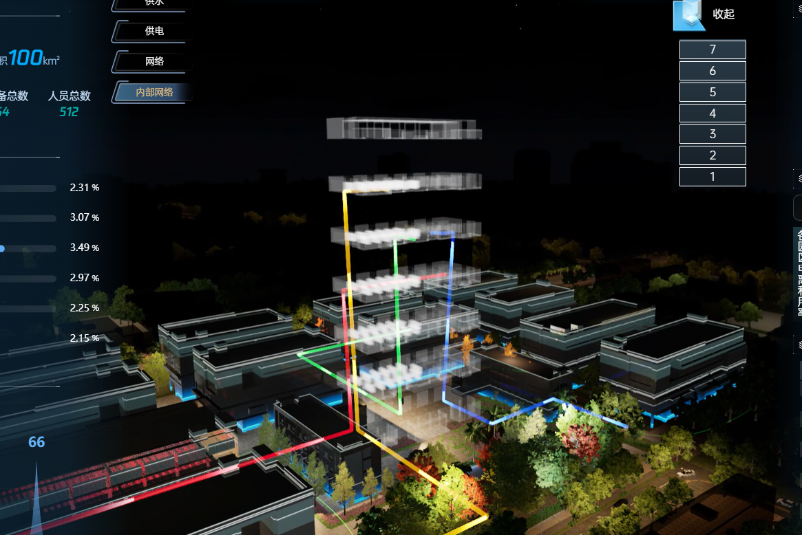

> 对于一些需要实现内网**网络，供水，供电**等的路径管道效果，可以使用该方法

## 效果



## 源码

```ts
let odData = [
    [
        [-1, 0, 0],
        [0, 0, 0],
        [0, 0, 4]
    ]
]
export const addOd = () => {
    const colorList = ['#ffaf00', '#0046ff', '#00ff57', '#ff002a']
    let arr: any = []
    odData.forEach((item: any, index: number) => {
        let o = {
            id: `beam_${index}`,
            coordinates: JSON.parse(JSON.stringify(item)).reverse(),
            duration: 10, //光流粒子的生命周期
            thickness: 0.05, //光流线的宽度比例
            interval: 0.1, //光流粒子发射间隔
            velocity: 0.1, //光流粒子的速度
            color: colorList[index] //光流的颜色
        }
        arr.push(o)
    })
    __g.beam.add(arr)
}
```

## 使用方法

```ts
addOd()
```

## 注意事项

要保证线可以直的往上走，线需要确保`x,y` 是一致的，只需要改变`z`值就行
